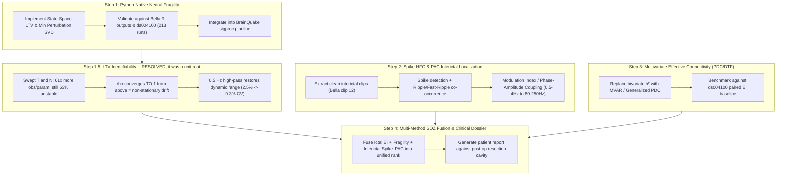

# Post-cEI Research Roadmap: Modern SOZ Detection Methods

**Date:** 2026-08-17  
**Status:** Active  
**Context:** Following the evaluation in [`docs/cei_evaluation.md`](../cei_evaluation.md), Cumulative Epileptogenicity Index (cEI) was found to be statistically non-significant compared to the baseline bipolar Epileptogenicity Index (EI) due to bivariate coupling limitations, hard-thresholding, and phase/volume-conduction confounds. This document establishes the research roadmap for modern, validated alternatives in SEEG/iEEG Seizure Onset Zone (SOZ) detection.

---

## 1. Core Research Directions (2021–2026 Literature)



---

## 2. Roadmap Phases

### Phase 1: Native Python State-Space Neural Fragility (`pyfragility`)
- **Scientific Foundation:** Li et al. 2021 (*Nature Neuroscience*, [PMC8547387](https://pmc.ncbi.nlm.nih.gov/articles/PMC8547387/)), Gunnarsdottir et al. 2022 (*Brain*).
- **Core Mechanism:** Fits a Linear Time-Varying (LTV) multivariate system $x[t+1] = A x[t]$ in sliding windows (250 ms) and computes the minimum Euclidean norm column perturbation $\Delta_k$ required to push the system matrix $A$ into instability ($\rho(A + \Delta_k e_k^T) \ge 1$).
- **Goal:** Replace external R/`EZFragility` dependencies with high-performance, native NumPy/SciPy modules in `app/sigproc/fragility.py`.
- **Target Metrics:**
  - Verify exact ranking parity against Bella's 8 seizures (`data/ezfragility_result.txt` where shaft D dominates with 4.83 votes/ch).
  - Run full benchmark on OpenNeuro `ds004100` (213 seizure runs).

### Phase 1.5: LTV identifiability — RESOLVED 2026-08-18, hypothesis rejected

**The dimensionality hypothesis is wrong.** Measured with
[`v2/tools/fragility/ltv_identifiability.py`](../../v2/tools/fragility/ltv_identifiability.py)
over all 8 Bella seizures, at fixed lambda with the escalation search disabled:

| mode | win | obs/param | % unstable @ OLS | @ 1e-4 | rho median @ OLS |
|---|---|---|---|---|---|
| joint | 0.25 s | 1.35 | 100.0 | 65.3 | 1.0144 |
| joint | 0.50 s | 2.71 | 99.7 | 72.4 | 1.0049 |
| joint | 1.00 s | 5.43 | 99.2 | 73.0 | 1.0025 |
| per-shaft | 0.25 s | 20.75 | 78.2 | 59.2 | 1.0017 |
| per-shaft | 0.50 s | 41.58 | 72.0 | 52.2 | 1.0005 |
| per-shaft | 1.00 s | 83.25 | 62.7 | 43.6 | 1.0001 |

Going from 1.35 to **83 observations per parameter** — 61x, far past any
under-determination — still leaves 63% of windows unstable. Raising T or cutting N
does not fix it.

**The actual cause is a unit root.** Under OLS, rho median converges *to* 1.0 from
above as T grows (1.0144 -> 1.0049 -> 1.0025 joint; 1.0017 -> 1.0005 -> 1.0001
per-shaft). That is the signature of an integrated / non-stationary process: more
data does not move rho away from 1, it converges there. The fit was estimating a
genuine near-unit root, not scattering on noise.

**The fix is the preprocessing Li et al. specify and `export_edf.py` omits.** A
4th-order 0.5 Hz Butterworth high-pass, applied before the fit:

| win (joint, lambda=1e-2) | shaft CV% unfiltered | + 0.5 Hz high-pass |
|---|---|---|
| 0.25 s | 2.52 (= the 2.49 baseline) | 4.50 |
| 1.00 s | 2.19 | 7.37 |
| 2.00 s | 2.62 | **9.33** |

Window length alone does nothing (2.19-2.62% across an 8x range). With the high-pass,
dynamic range scales with window and passes R's 8.25% at a 2 s window, at 2.0% of
windows unstable and R^2 0.998 — versus production's R^2 0.926 at lambda=0.3.

This does *not* contradict `cf03c79`'s "preprocessing ruled out": at the 250 ms
window that commit tested, the high-pass really does nothing (100.0% -> 99.6%
unstable). Its effect only appears once there are enough observations per parameter
for the drift term to be separable.

**Candidate fix #2 (per-shaft) is rejected on ranking, not stability.** It gives the
best conditioning in the grid and the worst localization: shaft CV 2.64-3.49%, and the
clinical onset shafts A and I fall to ranks 18 and 19. `size_delta_rho` goes negative
(-0.24), confirming the predicted artifact — the min-perturbation norm shrinks with
block size, so pooling deltas across 6- and 12-contact shafts ranks by shaft size.
Fitting shafts independently discards the cross-shaft coupling fragility is built on.

**Caveat — dynamic range is not quality.** Pushing the cutoff higher keeps inflating
CV while the clinical ranking degrades: 0.5 Hz -> CV 9.33% with A at rank 12; 1 Hz ->
9.95% at rank 13; 2 Hz -> 11.07% at rank 14. CV can be raised by deleting signal, so
0.5 Hz (Li et al.'s own figure) is the principled stopping point, not the CV maximum.

**What this does and does not settle.** It settles the measured deficiency: the
compressed dynamic range and the need for the lambda=0.3 escalation workaround are
both artifacts of fitting unfiltered, drift-dominated data. It does **not** improve
localization — shaft D holds rank 1 in every configuration and A/I never climb above
6-9. That is a separate open problem, and candidate fix #3 (low-rank A) is not
indicated by this evidence.

**Parity, measured against a regenerated EZFragility reference** (all 8 seizures
re-run; each reproduces `docs/bella_fragility_resection_analysis.md`'s R2 medians and
frag ranges exactly, so this is the same reference the earlier numbers came from):

| config | Spearman vs R | shaft CV% | % unstable | R^2 |
|---|---|---|---|---|
| 0.25 s, lambda=0.3, **unfiltered** (production today) | 0.4231 | 2.52 | 0.7 | 0.926 |
| 0.25 s, lambda=0.3, + 0.5 Hz high-pass | **0.794** | 4.50 | 0.8 | 0.991 |
| 0.25 s, lambda=1e-2, + high-pass | **0.811** | 4.44 | 27.5 | 0.999 |
| 1.00 s, lambda=1e-2, + high-pass | 0.764 | 7.37 | 7.9 | 0.999 |
| 2.00 s, lambda=1e-2, + high-pass | 0.752 | 9.33 | 2.0 | 0.998 |

Adding the high-pass and changing nothing else -- same 250 ms window, same
lambda=0.3 -- takes contact-level parity from **0.423 to 0.794**; lambda=1e-2 reaches
0.811. For scale, `verify_fragility_bella.py` gates at 0.8, though on the shaft-level
ranking rather than this contact-level figure, so the two are not interchangeable.
Every row here uses a fixed lambda with the escalation search disabled, including the
lambda=0.3 one -- so the 0.423 baseline row differs from production only in that.

Note the trade-off: parity peaks at R's own 250 ms window while dynamic range peaks
at 2 s. That is expected rather than contradictory -- Spearman-vs-R rewards matching
R's parameterisation, so 0.25 s is the honest parity figure and the longer windows are
a different question, not a better answer to the same one.

**Found while regenerating the reference: our ridge is not EZFragility's.**
`EZFragility:::ridge` scales the penalty per row by the inverse RMS of that
channel's target:

```r
lmbd <- n * lambda
Lscaled <- lmbd * sum(y^2/n)^-0.5   # y = row i of xtp1
dw <- d/(d^2 + Lscaled)
```

High-amplitude channels get *less* shrinkage, low-amplitude channels get *more*.
`fit_ltv_model` applies one global `l2 * trace(cov)/N` to every row identically.
Fragility ranks channels by nearness to instability, so per-channel differential
shrinkage shapes the ranking. It is closed-form and cheap (no per-electrode search,
contra the scheme rejected in `d983528`), and worth testing as a parity lever.

Two related corrections: EZFragility *does* enforce stability (bisecting lambda over
[1e-4, 10], 20 iterations), so that is not the difference; and its lambda is not
comparable to ours in absolute terms. Its realised lambdas on SZ1P are median 1e-4,
max 2.76e-3 -- it essentially never escalates, against our 0.3.

### Phase 2: Interictal Spike-Ripple Co-occurrence & Phase-Amplitude Coupling (PAC)
- **Scientific Foundation:** Dimakopoulos et al. 2023 (*Nat Comms*), Weiss et al. 2023, pyHFO 2025.
- **Core Mechanism:** Distinguishes pathological high-frequency oscillations (HFOs) from physiological ripples and artifacts by gating HFO detections with interictal epileptiform spikes (within $\pm 50\text{ ms}$) and quantifying Phase-Amplitude Coupling (PAC Modulation Index) between slow wave phase ($0.5–4\text{ Hz}$) and ripple amplitude ($80–250\text{ Hz}$).
- **Goal:** Enable reliable SOZ localization from interictal recordings without requiring clinical seizure capture.
- **Application:** Evaluate on Bella interictal clip 12 (`DA6465AU_12_20240317131709.edf`) and ds004100 interictal runs.

### Phase 3: Multivariate Effective Connectivity (Generalized Partial Directed Coherence — gPDC)
- **Scientific Foundation:** Baccalá & Sameshima, Sigg et al. 2023 (*IEEE TBME*), Barnett & Seth.
- **Core Mechanism:** Replaces bivariate $h^2$ non-linear regression with Multivariate Autoregressive (MVAR) model estimation. Computes directional gPDC and Directed Transfer Function (DTF) to eliminate spurious indirect paths.
- **Goal:** Establish a principled, direct-causality network measure across gamma/beta bands that improves upon energy-only EI on slow-onset seizures.

### Phase 4: Coordinate-Aware Multi-Method Fusion & Resection Dossier
- **Goal:** Combine complementary mathematical perspectives:
  1. Spectral energy acceleration (EI Band Ratio),
  2. Dynamical network fragility (State-space instability),
  3. Interictal micro-structure (Spike-Ripple PAC).
- **Validation:** Cross-validate against 3D Slicer electrode coordinates, FreeSurfer parcellations (`aparc+aseg.mgz`), and post-operative resection boundaries to generate clinical evaluation reports.
