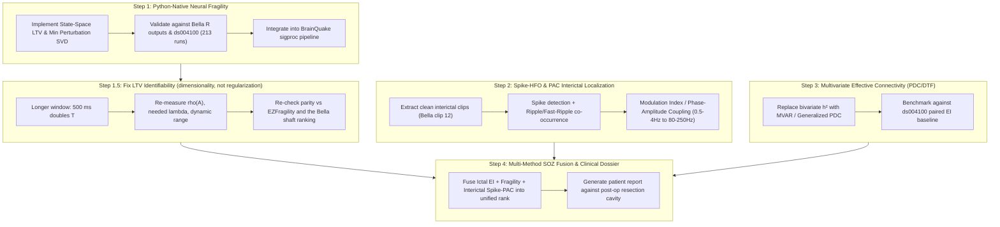

# Post-cEI Research Roadmap: Modern SOZ Detection Methods

**Date:** 2026-08-17  
**Status:** Active  
**Context:** Following the evaluation in [`docs/cei_evaluation.md`](../cei_evaluation.md), Cumulative Epileptogenicity Index (cEI) was found to be statistically non-significant compared to the baseline bipolar Epileptogenicity Index (EI) due to bivariate coupling limitations, hard-thresholding, and phase/volume-conduction confounds. This document establishes the research roadmap for modern, validated alternatives in SEEG/iEEG Seizure Onset Zone (SOZ) detection.

---

## 1. Core Research Directions (2021–2026 Literature)

---

## 2. Roadmap Phases

### Phase 1: Native Python State-Space Neural Fragility (`pyfragility`)
- **Scientific Foundation:** Li et al. 2021 (*Nature Neuroscience*, [PMC8547387](https://pmc.ncbi.nlm.nih.gov/articles/PMC8547387/)), Gunnarsdottir et al. 2022 (*Brain*).
- **Core Mechanism:** Fits a Linear Time-Varying (LTV) multivariate system $x[t+1] = A x[t]$ in sliding windows (250 ms) and computes the minimum Euclidean norm column perturbation $\Delta_k$ required to push the system matrix $A$ into instability ($\rho(A + \Delta_k e_k^T) \ge 1$).
- **Goal:** Replace external R/`EZFragility` dependencies with high-performance, native NumPy/SciPy modules in `app/sigproc/fragility.py`.
- **Target Metrics:**
  - Verify exact ranking parity against Bella's 8 seizures (`data/ezfragility_result.txt` where shaft D dominates with 4.83 votes/ch).
  - Run full benchmark on OpenNeuro `ds004100` (213 seizure runs).

### Phase 1.5: Fix the LTV fit's identifiability — dimensionality, not regularization
- **The lead to chase next is dimensionality, not regularization: a longer window (500 ms doubles T at the cost of time resolution).**
- **Why:** at 184 channels and a 250 ms window, each row of $A$ is fit from 249 sample pairs — **1.35 observations per parameter**. The fit nearly interpolates, so its eigenvalues scatter across the unit circle: measured on Bella, **100% of windows are spectrally unstable under OLS** (median $\rho \approx 1.014$) and 52–77% remain unstable at the $\lambda \approx 10^{-4}$ that both Li et al. and `EZFragility` use. No choice of $\lambda$ fixes an under-constrained fit; it only trades instability for shrinkage.
- **Ruled out (2026-08-18):** missing preprocessing is *not* the cause. Li et al. specify notch + 0.5 Hz–Nyquist 4th-order Butterworth before CAR, which `export_edf.py` omits. Applying it leaves $\rho_{OLS}$ unchanged (1.0124–1.0156) and makes $\lambda=10^{-4}$ instability *worse* (75–91%). The problem is the $N \approx T$ regime itself.
- **Cost of the current workaround:** `l2_reg = 0.3` clears stability on every window but parks them all at $\rho \approx 0.998$, compressing the shaft-mean fragility range to CV 2.49% vs R's 8.25% — a 3.3× loss of discriminability — and dropping contact-level Spearman vs `EZFragility` by 0.142 across all 8 seizures.
- **Candidate fixes, in order of expected payoff:**
  1. **Longer window** (500 ms → T = 499, 2.7 obs/param) at the cost of time resolution; the direct test.
  2. **Per-shaft or regional fits** instead of all 184 channels jointly, cutting N rather than raising T.
  3. Low-rank / factor-structured $A$, if 1 and 2 are insufficient.
- **Success criterion:** stability at a $\lambda$ near the paper's without the escalation search, with dynamic range at or above R's.

### Phase 2: Interictal Spike-Ripple Co-occurrence & Phase-Amplitude Coupling (PAC)
- **Scientific Foundation:** Dimakopoulos et al. 2023 (*Nat Comms*), Weiss et al. 2023, pyHFO 2025.
- **Core Mechanism:** Distinguishes pathological high-frequency oscillations (HFOs) from physiological ripples and artifacts by gating HFO detections with interictal epileptiform spikes (within $\pm 50\text{ ms}$) and quantifying Phase-Amplitude Coupling (PAC Modulation Index) between slow wave phase ($0.5–4\text{ Hz}$) and ripple amplitude ($80–250\text{ Hz}$).
- **Goal:** Enable reliable SOZ localization from interictal recordings without requiring clinical seizure capture.
- **Application:** Evaluate on Bella interictal clip 12 (`DA6465AU_12_20240317131709.edf`) and ds004100 interictal runs.

### Phase 3: Multivariate Effective Connectivity (Generalized Partial Directed Coherence — gPDC)
- **Scientific Foundation:** Baccalá & Sameshima, Sigg et al. 2023 (*IEEE TBME*), Barnett & Seth.
- **Core Mechanism:** Replaces bivariate $h^2$ non-linear regression with Multivariate Autoregressive (MVAR) model estimation. Computes directional gPDC and Directed Transfer Function (DTF) to eliminate spurious indirect paths.
- **Goal:** Establish a principled, direct-causality network measure across gamma/beta bands that improves upon energy-only EI on slow-onset seizures.

### Phase 4: Coordinate-Aware Multi-Method Fusion & Resection Dossier
- **Goal:** Combine complementary mathematical perspectives:
  1. Spectral energy acceleration (EI Band Ratio),
  2. Dynamical network fragility (State-space instability),
  3. Interictal micro-structure (Spike-Ripple PAC).
- **Validation:** Cross-validate against 3D Slicer electrode coordinates, FreeSurfer parcellations (`aparc+aseg.mgz`), and post-operative resection boundaries to generate clinical evaluation reports.
