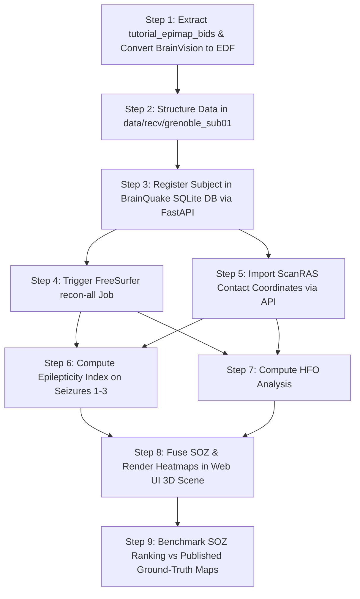

# Plan: Verification of BrainQuake v2 on Brainstorm Tutorial Dataset (`tutorial_epimap_bids`)

## Goal Description
Verify that BrainQuake v2's numeric algorithms (FreeSurfer reconstruction, 3D electrode contact visualization, Epilepticity Index calculation in `ictal.py`, HFO detection in `interictal.py`, and SOZ fusion in `soz.py`) yield scientifically accurate results by executing them on the official **Brainstorm Grenoble SEEG tutorial dataset** (`tutorial_epimap_bids`) and benchmarking the output against published clinical ground truth.

---

## Dataset Mapping (`tutorial_epimap_bids`)

| BIDS Dataset Component | Source Path | BrainQuake Pipeline Destination / Role |
|---|---|---|
| **Pre-implantation T1 MRI** | `sub-01/ses-preimp/anat/sub-01_ses-preimp_T1w.nii.gz` | Primary volume for `recon-all` (`data/recv/grenoble_sub01/T1.nii.gz`) |
| **Post-implantation T1 MRI** | `sub-01/ses-postimp/anat/sub-01_ses-postimp_T1w.nii.gz` | Post-op reference volume |
| **Seizure Clips 1–3** | `sub-01/ses-postimp/ieeg/sub-01_ses-postimp_task-seizure_run-0*_ieeg.vhdr` | Converted to `.edf` (`seizure_1.edf`, `seizure_2.edf`, `seizure_3.edf`) |
| **ScanRAS Contact Coordinates** | `sub-01/ses-postimp/ieeg/sub-01_ses-postimp_space-ScanRAS_electrodes.tsv` | Direct contact import (125 channels) via electrode API |
| **Seizure Onset Timing** | `sub-01/ses-postimp/ieeg/sub-01_ses-postimp_task-seizure_run-01_events.tsv` | Clinical onset time ($t = 120.369\text{s}$) for `ei_compute` |

---

## Workflow Diagram

---

## Detailed Step-by-Step Execution Plan

### Step 1: Ingestion & Conversion
- Extract `datasets/grenoble_seeg/tutorial_epimap_bids.zip`.
- Create target ingestion directory: `data/recv/grenoble_sub01/`.
- Copy `sub-01_ses-preimp_T1w.nii.gz` to `data/recv/grenoble_sub01/T1.nii.gz`.
- Symlink header references (`SZ1.eeg`, `SZ1.vmrk`, etc.) and convert `run-01`, `run-02`, and `run-03` to `seizure_1.edf`, `seizure_2.edf`, and `seizure_3.edf` using MNE & `edfio` in `v2/server/.venv`.
- Copy `sub-01_ses-postimp_space-ScanRAS_electrodes.tsv` to `data/recv/grenoble_sub01/ScanRAS_electrodes.tsv`.

### Step 2: Subject Registration & Recon
- Register subject `grenoble_sub01` via `POST /api/subjects/`.
- Queue `recon` job (`POST /api/recon/`) to run FreeSurfer `recon-all` on `T1.nii.gz`.

### Step 3: Contact Coordinate Import
- Import the 125 electrode contact coordinates from `ScanRAS_electrodes.tsv` using the electrode import endpoint (`POST /api/electrodes/import_slicer` or contact router).

### Step 4: EI & HFO Computation
- Queue `ei_compute` job (`POST /api/jobs/ei_compute`) on `seizure_1.edf` with baseline window ($0 - 110\text{s}$) and onset ($t = 120.369\text{s}$).
- Queue `hfo_compute` job (`POST /api/jobs/hfo_compute`).

### Step 5: SOZ Fusion & Web UI Validation
- Queue `soz_fuse` job (`POST /api/jobs/soz_fuse`).
- Inspect the top-ranked contacts in the React Three.js 3D viewer (`v2/web/`).
- Compare BrainQuake's top SOZ channels against published clinician annotations and Brainstorm tutorial epileptogenicity maps.

---

## User Review Required

> [!NOTE]
> **Execution Strategy**:
> - **Immediate**: Steps 1–3 (unpacking, EDF conversion, subject registration, queuing `recon-all`).
> - **Background**: FreeSurfer `recon-all` will run asynchronously in `workers/jobs_worker.py`.
> - **Follow-up**: Upon completion of `recon-all`, we will execute contact import, EI/HFO computation, and SOZ fusion.

---

## Verification Plan

### Automated Verification
- Verify `FastAPI` endpoint responses (`200 OK` on subject creation, job queueing, and artifact creation).
- Verify SQL records created in `brainquake.db` (`subjects`, `jobs`, `artifacts`).

### Manual Verification
- Open Web UI (`http://localhost:5173`) and navigate to `grenoble_sub01`.
- Verify 3D brain mesh and contact sphere overlays in the FreeBrowse / 3D viewer.
- Validate that the top 5 ranked contacts from `soz_fuse` match the clinical seizure onset contacts.
